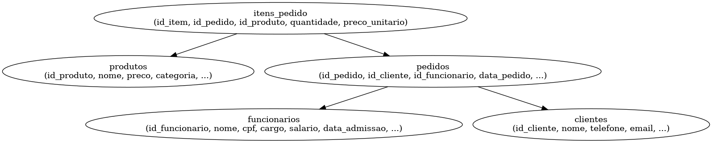

# Banco de Dados para Restaurante (MySQL)

Este projeto consiste na modelagem e criação de um banco de dados relacional para a gestão de um restaurante, utilizando MySQL.

## Objetivo
O objetivo do projeto é oferecer uma estrutura eficiente para armazenar, consultar e gerenciar dados de clientes, funcionários, produtos e pedidos em um restaurante.

## Estrutura do Banco

### Tabelas:
- **funcionarios**: informações dos colaboradores.
- **clientes**: cadastro dos clientes.
- **produtos**: pratos, bebidas e outros itens comercializados.
- **pedidos**: histórico de pedidos realizados.
- **itens_pedido**: detalhamento de cada item contido nos pedidos.

### Modelo Entidade-Relacionamento

## Tecnologias Utilizadas
- MySQL
- SQL padrão (DDL e DML)
- Ferramenta de modelagem: Graphviz

## Funcionalidades
- Inserção, atualização e remoção de dados
- Consultas relacionais
- Controle de estoque e vendas por pedido

## Autor
Jorge Eduardo Andrade das Dores
